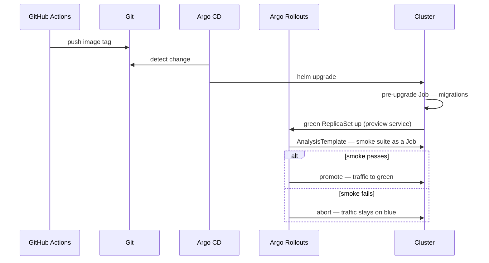

# Delivery

How code reaches the cluster. Decisions in
[ADR-0008](./adr/0008-gitops-blue-green.md).

## Branching

Trunk-based. Short-lived branches, pull requests into `main`, `main` always
deployable. **Pull requests are required** by branch protection — `main`
auto-deploys to production, so the PR is the only gate between a typo and a
rollout. Merging your own PRs is expected; skipping them is not.

Long-lived feature work hides behind flags rather than branches.

## What runs where

| Stage | Pull request | Merge to `main` |
|---|---|---|
| `cargo fmt --check`, `cargo clippy -D warnings` | • | • |
| `cargo sqlx prepare --check` | • | • |
| Unit, integration and index tests | • | • |
| Contract drift check — OpenAPI and TypeScript | • | • |
| Backward-compatibility check against previous release | • | • |
| Web typecheck, lint, build | • | • |
| Build and push images | | • |
| Bump image tag in `deploy/` | | • |

PRs build images and throw them away. Only `main` publishes, so the registry
never fills with dead branches.

## Images

Published to **GHCR**, pushed with the built-in `GITHUB_TOKEN`. The repository is
public, so images are public and the cluster pulls anonymously — **no registry
credential exists in GitHub secrets or in the cluster.**

Tagged with the **git SHA, never `latest`**. Manifests reference an immutable tag,
so what is deployed is knowable from the commit and rollback is a revert rather
than a cache-busting exercise.

`ghcr.io/nandanjp/mediadive-{api,worker,web}:<sha>`

## The tag bump

CI commits the new SHA into `deploy/` using `GITHUB_TOKEN`. **Pushes made with
that token do not trigger workflow runs** — GitHub's built-in recursion guard is
the loop guard. `paths-ignore: deploy/**` is belt and braces.

## GitOps

Argo CD reconciles the Helm umbrella chart in `deploy/charts/mediadive`. It cannot
decrypt SOPS natively, so **`helm-secrets` is configured as a repo-server
plugin** — expect this to be the fiddliest part of the bootstrap.

The **age private key is installed as a cluster secret by hand, once**, and never
enters git. It is the only secret in the system not stored encrypted in the
repository.

## Release

**Migrations run as a Helm `pre-upgrade` hook**, before new pods start. Safe
precisely because expand/contract guarantees the running version tolerates the new
schema.

**Promotion is automated and gated.** Argo Rollouts runs the smoke suite against
the preview service and promotes on success, aborts on failure.
`kubectl argo rollouts promote` remains available as an override. Fully manual
promotion sounds safer and is not — it means eventually promoting without looking.

## Rollback

An aborted rollout leaves traffic on blue; nothing to undo. For a bad release that
already promoted, revert the commit — Argo reconciles back to the previous SHA.

## Secrets

| Secret | Where |
|---|---|
| age private key | Cluster, installed by hand at bootstrap |
| Postgres credentials · Meilisearch master key · Garage access keys | SOPS-encrypted in `deploy/` |
| Resend API key · TMDB API key | SOPS-encrypted in `deploy/` |
| Session and CSRF signing secrets | SOPS-encrypted in `deploy/` |
| Feature flag provider key | SOPS-encrypted, pending [ADR-0009](./adr/0009-feature-flag-provider.md) |

AniList needs no credential — its public GraphQL API is unauthenticated.

Because the repository is public, SOPS ciphertext is public. That is the design,
but it sharpens two rules: the age key never enters git even briefly, and anything
committed by mistake is **rotated, not merely deleted**. SOPS encrypts values
only — field names remain readable.

## Properties

**CI never touches the cluster.** GitHub builds, pushes, and commits a tag; Argo
pulls from inside the homelab. No self-hosted runner, no kubeconfig in GitHub
secrets, **no inbound access to the network from GitHub at all.**

## Build cost

Rust build times dominate the pipeline. `cargo-chef` for Docker layer caching and
a shared `sccache` are load-bearing. Public repositories get unlimited free Actions
minutes on standard runners, so the constraint is wall-clock, not spend.

---

# Milestones

**Every milestone ends deployed to production** — not merged, deployed and
promoted. An increment that stops at `main` is a branch with extra steps.

| # | Milestone | Ships | Proves |
|---|---|---|---|
| 0 | **Skeleton** | Workspace, `api` + `worker`, one page, Helm chart, Argo CD, SOPS bootstrap, Postgres/Redis/Meilisearch/Garage, observability, trivial smoke test | The whole pipeline: commit → image → tag bump → sync → migration hook → green → smoke → promote |
| 1 | **Catalog** | Seed fixtures, media/person/character/credit, media page, search, cover art via the worker | Outbox, worker, Meilisearch, Garage — and a site worth looking at |
| 2 | **Identity** | Accounts, sessions, Google OAuth, email verification, profile, rate limiting | Auth end to end, Resend, and the first real generated contract |
| 3 | **Library** | Entries, statuses, progress, ratings, aggregates, analytics | In-transaction aggregates, coalesced index patches, cache invalidation |
| 4 | **Reviews** | Rich text, inline spoiler marks, privacy | The AST allowlist and server-rendered public content |
| 5 | **Lists** | Curated lists, hand-arrangement, public/private, featured | List indexing and privacy enforced at index time |
| 6 | **Admin** | Import preview/commit, re-import diff, genre merge, title requests | The catalog grows past the seed |
| 7 | **Moderation & editorial** | Reports, hide, block with aggregate fan-out, articles, article↔media links | The expensive fan-out path, and the last v1 capability |

**v1 is milestones 0–7.**

| # | Post-v1 | Notes |
|---|---|---|
| 8 | **Feature flag engine** | Resolves [ADR-0009](./adr/0009-feature-flag-provider.md). Deliberately late: its only consumers are milestone 9 onward, so building it earlier means infrastructure with nothing to gate. |
| 9+ | **Follow · Vote · Comment** | The flagged capabilities in [REQUIREMENTS.md](./REQUIREMENTS.md), shipping dark behind the engine. |

## Why catalog before identity

The instinct is accounts first, since everything hangs off them. But the catalog
is public, needs no auth, and *is* the product — shipping it first yields a real
browsable site early while exercising the most novel machinery (outbox, worker,
Meilisearch, Garage) against a small surface.

The seed fixtures are what make the ordering possible: five titles applied by
script means a populated catalog before any admin UI exists. Identity then unlocks
the write paths, and admin import arrives in milestone 6 to grow the catalog past
the seed.

## Notes

- The backward-compatibility check has no previous release to compare against
  until milestone 1. It is inert for exactly one deploy.
- Milestone 1 introduces the outbox, worker, Meilisearch and Garage together.
  There is a clean seam — catalog read from Postgres, then search and images — if
  it proves too large in practice.
