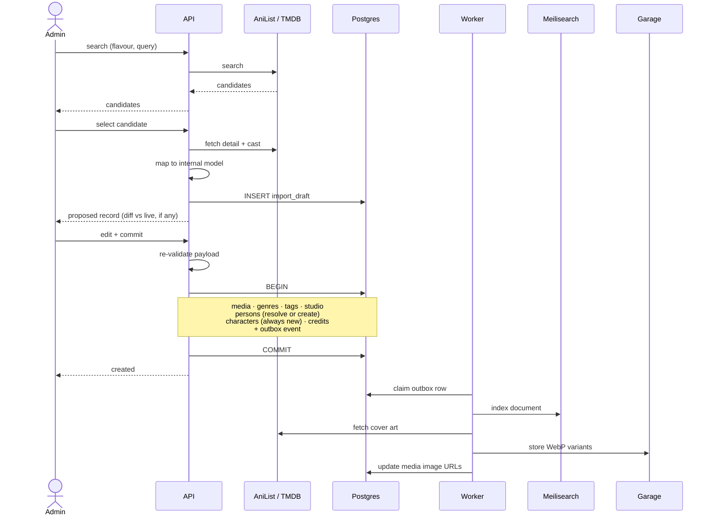
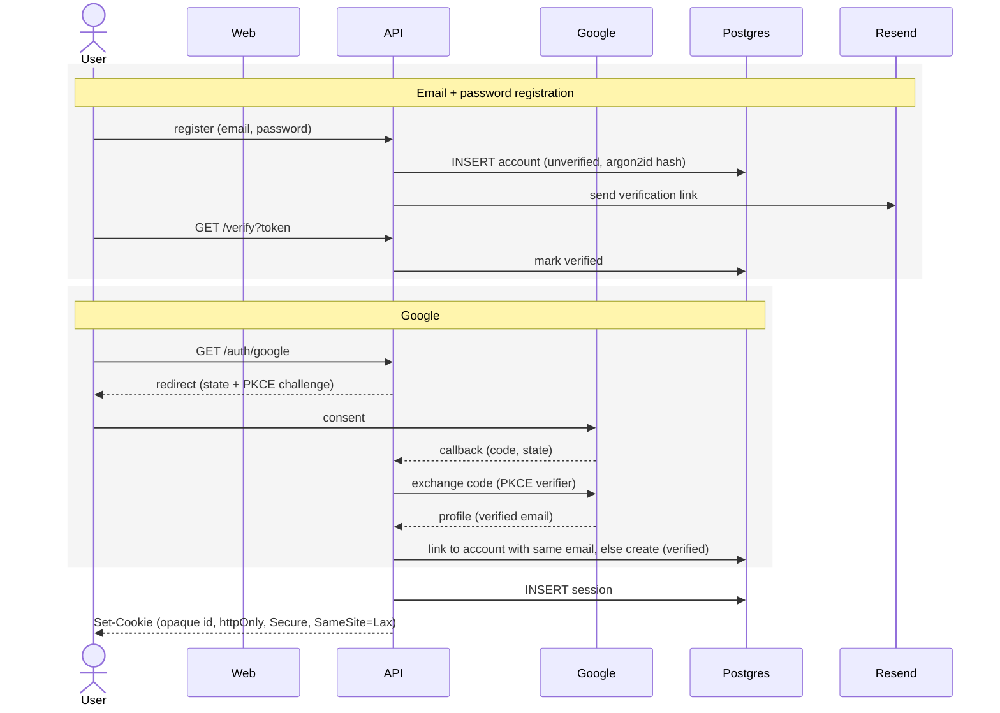
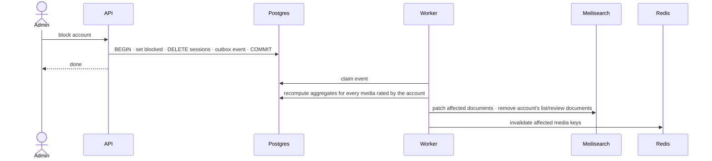

# Flows

The eight flows that carry a real decision or failure mode. List CRUD, profile
edits, TitleRequest submission, analytics reads and article publishing are
deliberately absent — they are a handler and a query.

Terms: [CONTEXT.md](./CONTEXT.md) · System: [ARCHITECTURE.md](./ARCHITECTURE.md)

---

## 1 · Catalog import

Flavour determines source: **anime → AniList, drama and movie → TMDB**. The admin
picks the flavour first, so exactly one upstream API is ever queried — no fan-out,
no merging heterogeneous result shapes.

An import is a **draft**, then a **commit**. The same screen serves first import,
re-import and manual correction: a proposed record beside the current state, with
the admin choosing what applies.

**Commit never re-contacts upstream.** What the admin approved is exactly what is
written; there is no window for upstream to change underneath the review.

**Person resolution is by `(source, external_id)` only.** This is the common case,
not the edge case — importing several TMDB dramas hits the same actor repeatedly.
Name-based fuzzy matching is deliberately not implemented: the cross-source
collision it would solve is rare, and silent false merges are worse than
duplicates. *Accepted consequence:* one human appearing via both AniList and TMDB
exists as two Person rows until a merge tool is built.

**Characters are never deduplicated.** A Character belongs to exactly one Media,
so season 2 creates fresh Character rows for the same fictional people.

**Genres and Tags are created on first sight** from upstream values. Because the
two sources disagree on names — TMDB's `Action & Adventure` versus AniList's
`Action`, `Sci-Fi & Fantasy` versus `Sci-Fi` — an admin **merge action** folds one
Genre into another and retains the upstream string as an alias, so later imports
resolve without re-deciding. Without merging, filters fragment silently.

**Drafts** expire on a timer so abandoned ones do not accumulate.

**Seeding** is five pre-reviewed payloads committed as fixtures and applied
idempotently through the commit path — no upstream dependency at deploy time, and
a realistic corpus for integration tests. Everything beyond those five is imported
by hand.

---

## 2 · Authentication

- **Email and password accounts cannot log in until verified.** Google accounts
  are verified by definition.
- **Linking is by verified email.** Google asserting the address is what makes the
  link safe; without it a user ends up with two accounts and two libraries.
- **Sessions slide** on activity. The cookie holds an opaque id; state lives in
  Postgres, so revocation is a `DELETE`.
- **CSRF**: `SameSite=Lax`, plus an origin check, plus a double-submit token.
- **Rate limits** in Redis on login, registration and password reset.
- **Password reset** tokens are single-use and expiring, and completing a reset
  invalidates every existing session.
- **Blocking** deletes all of an account's sessions in the same transaction as the
  flag.

---

## 3 · Search

Queries are answered **directly from Meilisearch** — no round trip to Postgres.
Catalog metadata changes only on admin action, so seconds of staleness are
invisible, and the data is public, so there is no per-viewer filtering to apply.

Four indexes — `media`, `person`, `list`, `article` — queried together via
multi-search for the global search box, and individually for scoped surfaces.

The `media` document carries everything results display: both title scripts,
flavour, year, country, episode count, genres, tags, cover URL, average rating and
rating count. Filters: genre, tag, country, episode count, flavour.

**Privacy is an indexing concern, not a query concern.** Only public Lists are
indexed, and flipping a profile to private removes its documents. Blocked accounts'
documents are removed on block. Filtering at query time instead would mean the
index holds data it must never return — one bug away from leaking it.

---

## 4 · Library write

A LibraryEntry write — add, status change, progress, or rating — and the rating
aggregate for that media are **one transaction**. The aggregate is a full `AVG`
over entries, excluding blocked accounts, not an incremental adjustment.

On commit: the outbox event patches the search document, and `media:{id}` is
deleted from Redis. Cache invalidation matters here specifically for
read-your-own-writes — rate a show, return to its page, and a TTL-only cache would
show the previous average.

**The worker coalesces index patches by media id** within a drain batch. Ratings
are the highest-frequency write in the system; twenty ratings on one title between
drains must produce one patch, not twenty.

> **Deferred optimization.** Maintaining `rating_sum` and `rating_count` columns
> turns each read into a division and each write into two increments. It is the
> right answer at scale and premature now: it drifts if any edit or delete path is
> wrong, and full recomputation is trivial at our volume. Revisit when aggregate
> recomputation shows up in query timings.

---

## 5 · Review write

One Review per `(member, media)`, and the media must already be in the member's
Library. Body is ProseMirror JSON stored as JSONB.

**The server validates node and mark types against an allowlist and rejects
anything unknown** — including the custom spoiler mark, which must be listed
explicitly. Clients post arbitrary JSON; without this, a crafted document is an
XSS vector the moment anything renders it.

Rendering happens in Next.js server components, because reviews are public content
on indexed pages. Spoiler regions stay in the DOM, hidden by CSS, so they remain
accessible and indexable.

Hiding a review **never changes a rating aggregate** — the rating lives on the
LibraryEntry. Moderation and scores are fully decoupled.

---

## 6 · Media page read

Split by cacheability, not by entity:

| Call | Contents | Cache |
|---|---|---|
| Public composite | media, credits, relations, aggregate, linked articles | Redis, `media:{id}:v{n}` |
| Viewer state | this member's LibraryEntry and Review | none |
| Reviews | paginated | none |

Merging viewer state into the composite would make it uncacheable for everyone,
and every anonymous visitor would pay for a personalization lookup returning
nothing. Visitor is a first-class role and these are the pages search engines
index.

**Cache keys carry a schema version.** Under blue-green both colours share one
Redis; green writing a new DTO shape that blue then deserializes is corruption.
Versioned keys make the generations miss each other instead.

Invalidated by: any catalog write for that media, and any rating write against it.

---

## 7 · Moderation

A Report carries a reason and an optional note, with **one open report per
reporter and target** so a single member cannot flood the queue. Admin actions are
hide-review and block-account.

**Blocking is the one expensive operation in the system.** Excluding a blocked
member's ratings means recomputing the aggregate for every media they rated —
potentially hundreds — and patching each search document.

Everything else about blocking is **read-time filtering on account status** —
reviews, lists and profile disappear with no denormalized state to maintain.
Unblocking runs the same path in reverse.

---

## 8 · Images

**Cover art** is fetched by the worker after an import commits, converted to WebP
in two variants — grid thumbnail and detail image — and stored in Garage.
Pre-generating beats optimizing per request on a homelab: predictable one-time CPU
instead of per-request CPU.

**Avatars upload through the API, not by presigned PUT.** Presigning would require
Garage to be browser-writable, validate the file only after storing it, and serve
user-supplied bytes verbatim. Re-encoding server-side guarantees the object is an
image, enforces dimensions, and **strips EXIF** — which on a phone photo includes
GPS coordinates.

Presigning would not raise the size ceiling anyway: a presigned PUT traverses the
same Cloudflare tunnel, which caps request bodies at 100 MB on the free plan.

**The binding limit is decode memory, not bytes.** A 24-megapixel photo is ~96 MB
as raw RGBA regardless of its compressed size. So: a generous byte cap (15 MB,
beyond any phone photo), plus a **dimension guard read from the image header
before decoding**, rejecting oversized images before anything is allocated.

> Axum's default body limit is 2 MB and must be raised per route, or uploads fail
> with a 413 that reads like a bug.

**Serving** is a public-read bucket routed at `/images/*` on the app hostname,
straight to Garage by Traefik. Images never transit the API and cache
independently, and a path keeps them same-origin on one DNS record rather than
needing a second hostname and tunnel route.
